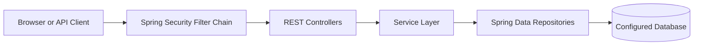
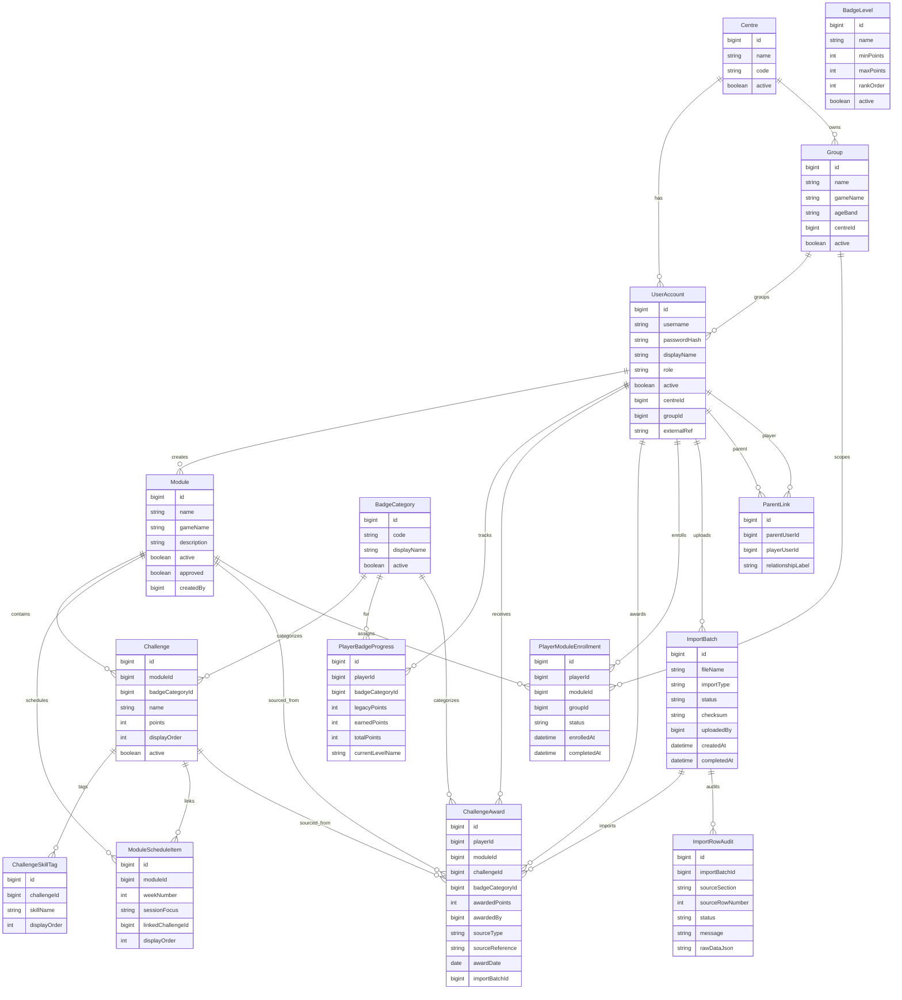
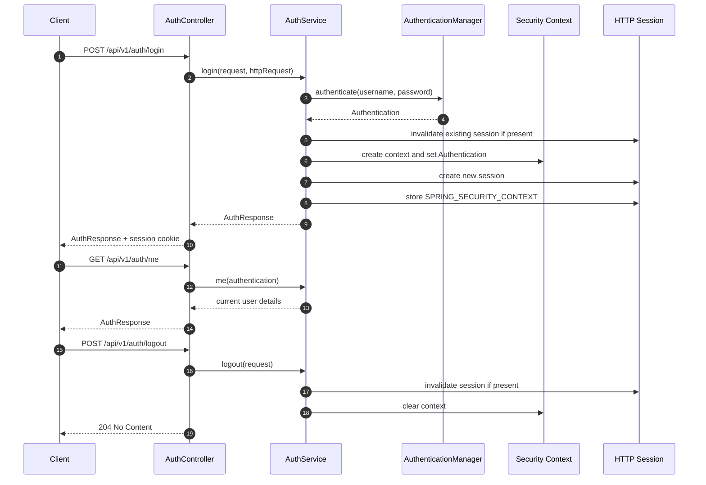
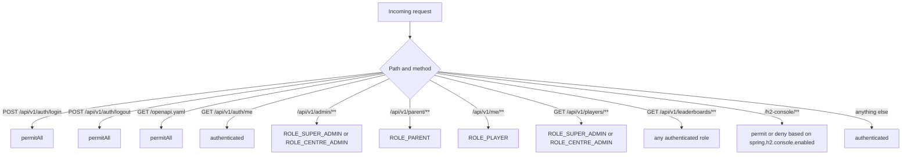
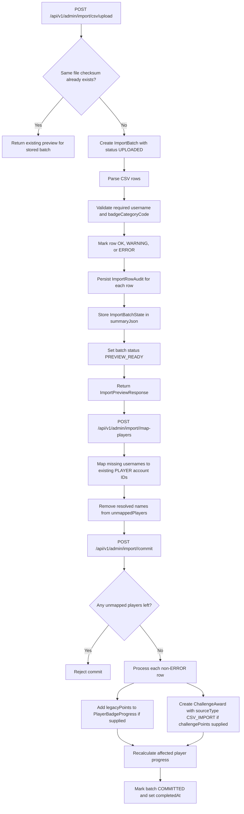
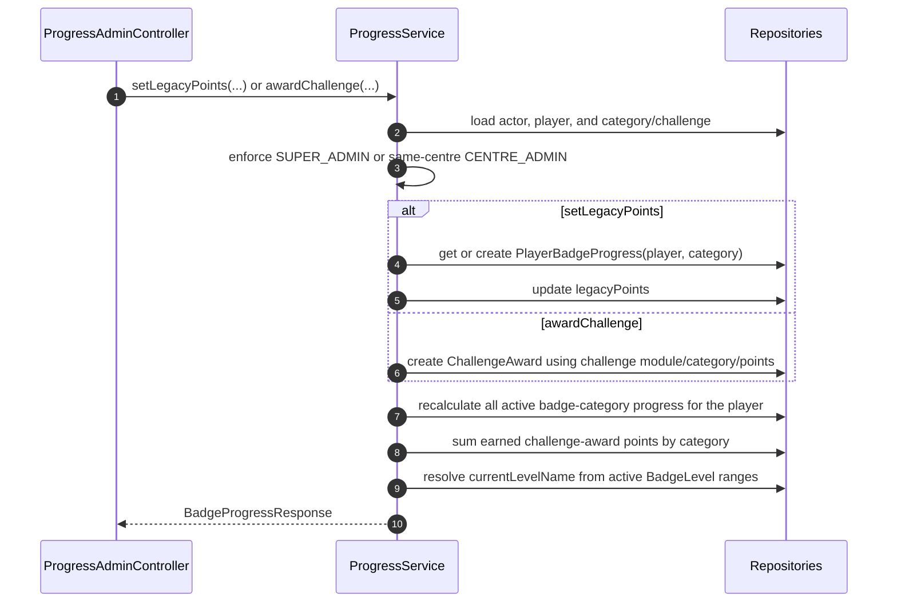
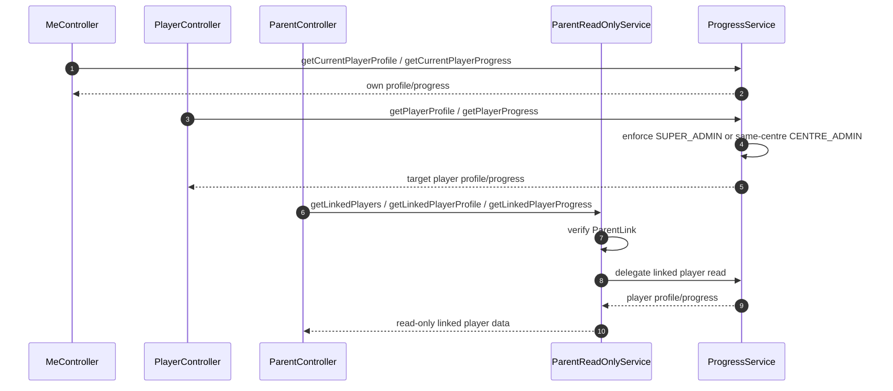

# Architecture

## Table of Contents
- [System Overview](#system-overview)
- [High-Level Architecture](#high-level-architecture)
- [Backend Component Architecture](#backend-component-architecture)
- [Domain Model](#domain-model)
- [Login and Session Flow](#login-and-session-flow)
- [Authorization and Role Model](#authorization-and-role-model)
- [CSV Import Flow](#csv-import-flow)
- [Progress and Player Read Flow](#progress-and-player-read-flow)
- [Security Behavior Summary](#security-behavior-summary)
- [Local Run Instructions](#local-run-instructions)

## System Overview
This repository contains a Spring Boot backend that exposes session-authenticated REST endpoints under `/api/v1`. Controllers handle authentication, administration, imports, player/parent reads, and leaderboards. Services implement business rules for user management, centres/groups/modules, enrollments, CSV import preview/commit, player progress, and parent read-only access. Persistence is built around JPA entities such as `UserAccount`, `Module`, `Challenge`, `PlayerBadgeProgress`, `ChallengeAward`, and `ImportBatch`.

## High-Level Architecture

## Backend Component Architecture

```mermaid
flowchart TD
    subgraph Web[Controllers]
        AuthController
        AdminUserController
        CentreAdminController
        GroupAdminController
        ModuleAdminController
        EnrollmentAdminController
        ImportController
        ProgressAdminController
        PlayerController
        MeController
        ParentController
        LeaderboardController
    end

    subgraph Security[Security]
        SecurityConfig
        CustomUserDetailsService
    end

    subgraph Services[Services]
        AuthService
        AuthenticatedUserService
        AdminUserService
        CentreAdminService
        GroupAdminService
        ModuleAdminService
        EnrollmentAdminService
        CsvImportService
        ImportPreviewService
        PlayerMappingService
        ImportCommitService
        ProgressService
        ParentReadOnlyService
        LeaderboardService
    end

    subgraph Data[Persistence]
        Repositories
        Entities
    end

    SecurityConfig --> CustomUserDetailsService
    SecurityConfig --> Web

    AuthController --> AuthService
    AdminUserController --> AdminUserService
    CentreAdminController --> CentreAdminService
    GroupAdminController --> GroupAdminService
    ModuleAdminController --> ModuleAdminService
    EnrollmentAdminController --> EnrollmentAdminService
    ImportController --> CsvImportService
    ImportController --> ImportPreviewService
    ImportController --> PlayerMappingService
    ImportController --> ImportCommitService
    ProgressAdminController --> ProgressService
    PlayerController --> ProgressService
    MeController --> ProgressService
    ParentController --> ParentReadOnlyService
    LeaderboardController --> LeaderboardService

    AuthService --> AuthenticatedUserService
    ParentReadOnlyService --> ProgressService

    AuthenticatedUserService --> Repositories
    AdminUserService --> Repositories
    CentreAdminService --> Repositories
    GroupAdminService --> Repositories
    ModuleAdminService --> Repositories
    EnrollmentAdminService --> Repositories
    CsvImportService --> Repositories
    ImportPreviewService --> Repositories
    PlayerMappingService --> Repositories
    ImportCommitService --> Repositories
    ProgressService --> Repositories
    ParentReadOnlyService --> Repositories
    LeaderboardService --> Repositories
    Repositories --> Entities
```

## Domain Model

`BadgeLevel` is intentionally standalone in the schema: progress stores the resolved level name as text, and `ProgressService` applies the active level ranges globally from `minPoints`/`maxPoints`.

## Login and Session Flow

## Authorization and Role Model

Important behavior from the reviewed code:

- `SecurityConfig` gives both `SUPER_ADMIN` and `CENTRE_ADMIN` access to every `/api/v1/admin/**` endpoint. The backend does **not** currently restrict centre creation, user management, module management, enrollment management, or import endpoints to super-admin only.
- `ProgressService` adds the main service-level scope check: `SUPER_ADMIN` can manage any player, `CENTRE_ADMIN` can only manage players in the same centre, and other roles are rejected.
- `ParentReadOnlyService` verifies a `ParentLink` before allowing `/api/v1/parent/players/{playerId}/profile` or `/progress`.
- Player self-service reads are exposed through `/api/v1/me/**`, not through a separate player-only write API.
- Leaderboards are available to any authenticated user, regardless of role.

## CSV Import Flow

What the import code actually does:

- Upload preview is checksum-based, so re-uploading the exact same file returns the existing batch preview instead of creating a duplicate batch.
- Unknown usernames are treated as `WARNING`, not `ERROR`, because they can be resolved through explicit mapping.
- Mapping only accepts existing `PLAYER` accounts; the import flow does not auto-create users.
- Commit skips rows marked `ERROR`.
- Commit can create challenge-award records from `challengePoints`, update legacy points from `legacyPoints`, or do both for the same row.
- Imported awards are created directly from CSV row data; `ImportCommitService` does not populate `challenge` or `module` on those `ChallengeAward` records.

## Progress and Player Read Flow

Additional notes:

- `PlayerBadgeProgress` is unique per `(player, badgeCategory)`.
- Profile/progress reads initialize missing progress rows for every active badge category before returning data.
- `totalPoints` is derived on save as `legacyPoints + earnedPoints`.
- `earnedPoints` comes from summing `ChallengeAward.awardedPoints` by player and badge category.
- `currentLevelName` is recalculated from active `BadgeLevel` ranges ordered by `rankOrder`.
- The duplicate-handling logic in `ProgressService` only protects concurrent creation of `PlayerBadgeProgress` rows; it does not deduplicate challenge awards.

## Security Behavior Summary
- Authentication is session-based and uses Spring Security's `AuthenticationManager`, `DaoAuthenticationProvider`, `CustomUserDetailsService`, and `BCryptPasswordEncoder`.
- Login explicitly invalidates any existing HTTP session before creating a fresh authenticated session.
- Logout invalidates the current session if it exists and clears the `SecurityContextHolder`.
- CSRF is disabled in `SecurityConfig`.
- Unauthenticated protected requests receive HTTP `401 Unauthorized` via `HttpStatusEntryPoint`.
- CORS uses Spring's default configuration hooks (`cors(Customizer.withDefaults())`).
- `/h2-console/**` is denied unless `spring.h2.console.enabled` resolves to `true`; when enabled, frame options are relaxed to `sameOrigin`.
- Because `SecurityConfig` protects by path, and `ProgressService`/`ParentReadOnlyService` add important business checks, both layers matter for correct authorization.

## Local Run Instructions
1. From the repository root, start the backend with `.\mvnw.cmd spring-boot:run`. If the wrapper is unavailable in your environment, use `mvn spring-boot:run`.
2. The Spring Boot app listens on port `8080` by default.
3. Use `POST /api/v1/auth/login` to create a session, then send the session cookie on later API requests.
4. `GET /openapi.yaml` is public and can be used to inspect the API surface locally.
5. Leave `APP_H2_CONSOLE_ENABLED` unset (or `false`) for normal local work.
6. If you need the H2 console, set `APP_H2_CONSOLE_ENABLED=true` before startup; that enables `/h2-console/**`.
