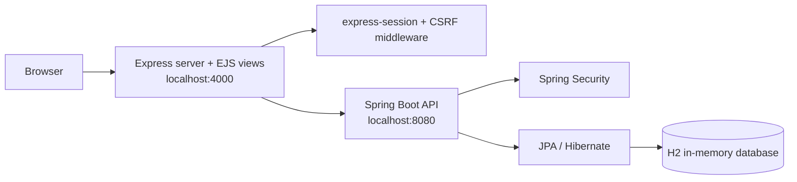

# WISHAW Platform Presentation

## 1. Executive summary

WISHAW is a role-based esports academy application with a **server-rendered Node.js frontend** and a **Java Spring Boot backend**. The current implementation is **not React**: users access an **Express + EJS** web app on port **4000**, and that app integrates with a Spring Boot API on port **8080**.

### Key message for presentation
- Frontend: **Node.js + Express + EJS + express-session + CSS**
- Backend: **Java + Spring Boot + Spring Security + JPA/Hibernate + H2 + Maven**
- Delivery model: **multi-role platform** for admins, players, and parents
- Security posture: **some useful hardening is in place**, but a few important issues still remain and should be stated accurately

---

## 2. Confirmed architecture



### What this means
- The browser talks to the **Express application**.
- The Express application renders **EJS templates** and serves static assets such as **CSS**.
- The Java backend provides authenticated API endpoints and persists data through **JPA/Hibernate** to **H2** in local development.

---

## 3. Actual tech stack

| Layer | Technology | Purpose |
|---|---|---|
| Frontend | Node.js | Runtime for the web application |
| Frontend | Express | Web server and routing |
| Frontend | EJS | Server-rendered HTML views |
| Frontend | express-session | Session handling for the Node app |
| Frontend | CSS | Application styling |
| Backend | Java | Backend language |
| Backend | Spring Boot | API and application framework |
| Backend | Spring Security | Authentication and authorization rules |
| Backend | JPA / Hibernate | Data access and ORM |
| Backend | H2 | Local in-memory database |
| Backend | Maven | Build and run tooling |

---

## 4. Role-based features in the current app

The current navigation and route setup supports these user experiences:

| Role | Features exposed in the current app |
|---|---|
| `SUPER_ADMIN` | Dashboard, Centres, Groups, Players, Modules, Award Progress, Leaderboard, and **CSV Import** |
| `CENTRE_ADMIN` | Dashboard, Centres, Groups, Players, Modules, Award Progress, Leaderboard |
| `PLAYER` | My Profile, Leaderboard |
| `PARENT` | My Children dashboard, child profile/progress access through parent routes, Leaderboard |

### Important nuance
- **CSV Import is currently exposed only to `SUPER_ADMIN` in the frontend navigation.**
- `SUPER_ADMIN` and `CENTRE_ADMIN` both see the main admin navigation.
- **Parent Links, Challenges, and Schedule** are shown only when the frontend is running with `USE_MOCK=true`.
- This is a **server-rendered EJS application**, not a SPA.

---

## 5. Security hardening that is actually present

The following controls are directly visible from the inspected code:

| Area | Confirmed implementation | Why it matters |
|---|---|---|
| Frontend session cookie | `httpOnly`, `sameSite='lax'`, 24-hour `maxAge`, and `secure='auto'` in production-like mode | Improves cookie safety and reduces client-side access to session cookies |
| Frontend CSRF handling | Express app applies token generation and verification middleware | Adds request-integrity protection on the Node frontend |
| Password storage strategy | Spring Security uses `BCryptPasswordEncoder` | Better password hashing than plaintext or weak hashing |
| Backend authorization | Spring Security restricts `/api/v1/admin/**`, `/api/v1/parent/**`, `/api/v1/me/**`, and leaderboard access by role/authentication | Enforces role-based backend access |
| H2 console exposure | H2 console is denied unless explicitly enabled | Reduces unnecessary attack surface in normal local runs |

### Practical security summary
- There is **real hardening in place** on sessions, cookies, frontend CSRF, password encoding, and endpoint authorization.
- The platform is **not fully hardened yet**, so the presentation should describe progress honestly rather than claim security is complete.

---

## 6. Remaining findings that should be presented accurately

These are the main issues still visible from the inspected files:

1. **Backend CSRF is disabled.**  
   In `SecurityConfig`, Spring Security is configured with `.csrf(csrf -> csrf.disable())`.

2. **Local seed credentials are still hardcoded in configuration.**  
   `application.properties` includes:
   - `app.seed.admin-username=superadmin`
   - `app.seed.admin-password=admin123`

3. **Frontend still has a default development session secret fallback.**  
   If `SESSION_SECRET` is not set, the Node app falls back to a built-in dev secret. That is acceptable for quick local development, but it should not be relied on for shared demos or production-like environments.

4. **Backend CORS comments/origins still reference old React dev ports.**  
   `application.properties` still lists `http://localhost:3000,http://localhost:5173`, which is stale relative to the current Express + EJS frontend.

### Recommended wording in a presentation
> We have implemented meaningful session, cookie, frontend CSRF, password-encoding, and route-authorization controls. However, backend CSRF is still disabled, local seed credentials still need cleanup, and some configuration still reflects the older React-era setup.

---

## 7. Local run instructions for the actual application

### Backend
Run the Spring Boot API from the Java project directory:

```powershell
Set-Location C:\Users\5611124\source\repos\51a7db-tfg_hack_wishaw-java
mvn spring-boot:run
```

- Backend URL: **http://localhost:8080**
- Port comes from `server.port=8080` in `application.properties`

### Frontend
Run the Express + EJS frontend from the Node project directory:

```powershell
Set-Location C:\Users\5611124\source\repos\51a7db-tfg_hack_wishaw-node-main
$env:API_BASE_URL = 'http://localhost:8080'
$env:SESSION_SECRET = 'change-me-for-demo'
npm install
npm start
```

- Frontend URL: **http://localhost:4000**
- Port comes from `process.env.PORT || '4000'` in `bin\www`

### Notes
- `SESSION_SECRET` is **strongly recommended** for demos and shared environments.
- If you omit `API_BASE_URL`, the frontend already defaults to **http://localhost:8080**.
- There is **no React dev server** in the current app.

---

## 8. Presentation talking points

### Suggested story
1. Start by clarifying that the delivered frontend is **Express + EJS**, not React.
2. Show the browser-based app on **localhost:4000** and explain that it integrates with the Spring Boot API on **localhost:8080**.
3. Walk through the role model: admin flows, player profile/leaderboard access, and parent child-progress visibility.
4. Highlight the real hardening already present: safer cookies, frontend CSRF, BCrypt password encoding, role-based backend protection, and disabled-by-default H2 console.
5. Close with the remaining work: backend CSRF, seed credential cleanup, and stale configuration cleanup.

### Short conclusion
WISHAW is presentation-ready as a **Node/Express/EJS + Spring Boot** application, provided the discussion stays aligned with the implementation that actually exists today.
